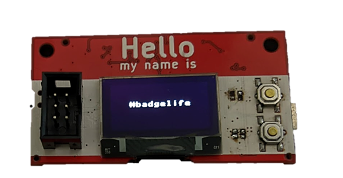

# The 'Hello my name is' PCB Badge

This **#Badgelife** PCB was created to test some circuits to be used in future art PCBs.
I also wanted a small project to bring to local hardware meetups.   

## Features:
* Powered by x2 AA Batteries
* Highly compatible with JLCPCB's basic SMT parts
* Raspberry Pi RP2040 uC w/ Dual core ARM Cortex-M0+
* OLED Screen, RGB LEDs, Buttons
* SAO Connector!

## Issues:
* I seen someone's design online using a RGB led running at 3.3V (below spec). I tried to replicate it and the LEDs were very flaky and worked intermittently. Experiment failed 😢.
* AA boost converter not yet tested, just using USB power so far.

