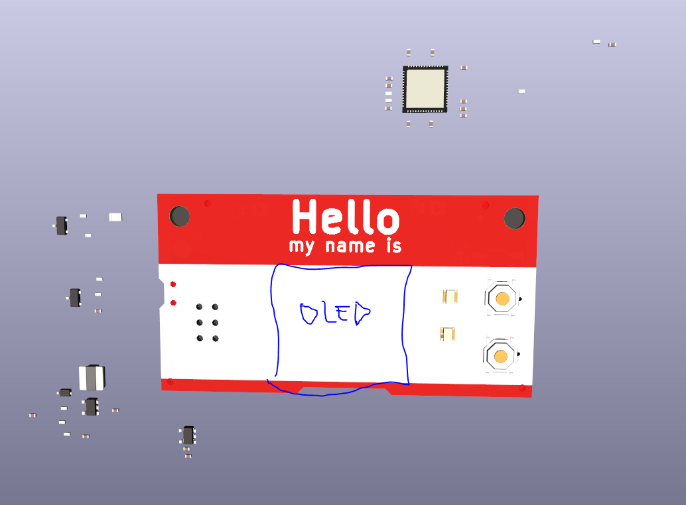

# The 'Hello my name is' PCB Badge

The **#Badgelife** PCB was created to test some circuits to be used in future art PCBs.
I also wanted a small project to bring to local hardware meetups.   

Features:
* Powered by x2 AA Batteries
* Highly compatible with JLCPCB's basic SMT parts
* Raspberry Pi RP2040 uC w/ Dual core ARM Cortex-M0+
* OLED Screen, RGB LEDs, Buttons
* SAO Connector!

# WIP
