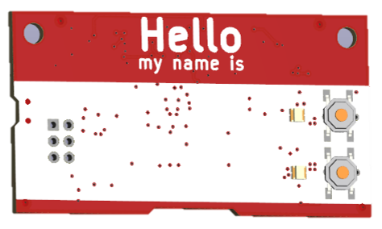

# The 'Hello my name is' PCB Badge
This **#Badgelife** PCB was created to test some circuits to be used in future art PCBs.
I also wanted a small project to bring to local hardware meetups. Partial assembly done at jlc.

 *missing front buttons on this test PCB
## Features:
* Powered by x2 AA Batteries
* Highly compatible with JLCPCB's basic SMT parts
* Raspberry Pi RP2040 uC w/ Dual core ARM Cortex-M0+
* OLED Screen, RGB LEDs, Buttons
* SAO Connector!

## v1 Issues:
I rushed this project a lot. Schematic was done in a few nights, layout and routing in a few hours with no review. This PCB has a few mistakes. Not planning on making another board spin but leaving this list here. 
* I seen someone's design online using a RGB led running at 3.3V (below spec). I tried to replicate it and the LEDs were very flaky and worked intermittently. Experiment failed 😢.
* AA boost converter not yet tested, just using USB power so far.
### Possible v2 Wishlist [v2 Todo]:
* User led + pwr led 
* ON OFF silk on switch
* Buzzer would be fun
* 5.1k USB cc1 cc2
* Planes on batt terminals to prevent lifting
* Use RPI boost for AA supply instead of boost converter
		○ Its nice to have 5V for leds
* Sao is to big for this little thing.
* GND probe clip stuffing option
* lvl shifter for RGBs

## Example GIF ⚡

